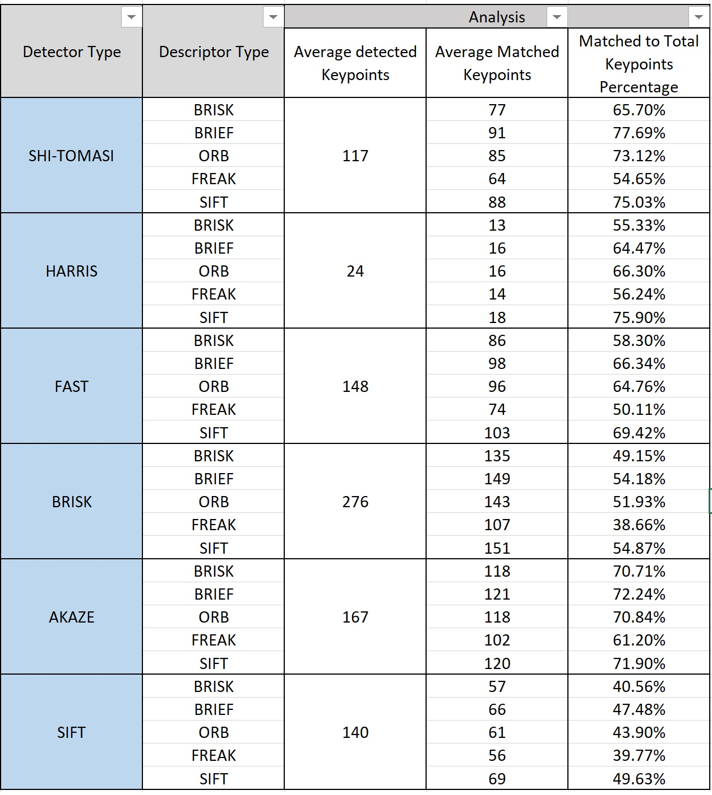

# SFND 2D Feature Tracking

## The second project for Sensor Fusion nanodegree from Udacity.

This project is primarily focused on the following topics:

- Implementing a buffer to avoid exessive usage of memory wile processing a sequence of images; thus, preventing potential slowing down of the program 
- Utilizing various keypoint detectors such as: Shi-Tomasi, Harris, FAST, BRISK, ORB, AKAZE, and SIFT
- Utilizing differnt keypoint descriptors and ultimately matching the keypoints in succesive images using Brute Force/FLANN and NN/kNN

### Results

**Keypoints detected using FAST detector on the entire image frame**

**Keypoints detected using FAST detector only on the front car**

**Matching keypoints detected (Shi Tomasi - BRIEF) in two consecutive images**

#### MP.7 Performance evaluation 1
- Count the number of keypoints on the preceding vehicle for all 10 images and take note of the distribution of their neighborhood size. Do this for all the detectors you have implemented.

**The average number of keypoints detected and the average processing time for 10 consecutive images**

As seen in table above, the number of keypoints detected varies considerably with different detector types. One comparison criteria could be simply looking at the highest number of keypoints detected; however, I think it is also important to compare the detector types performance based on the number of keypoints detected and the time it took for the detector to detect those keypoints. Therefore, I defined a metric in which the number of keypoints detected is normalized based on the processing time (last column in the table).
Following this metric, we can clearly conclude that FAST detector perfrom significantly faster than othe detectors while detecting acceptable number of keypoints. For example, BRISK detects almost two time more keypoints than FAST does; but at the cost of being almost 40 times slower. 

This conclusion can be seen in the following figure. 

**The average number of keypoints detected and num keypoints per time**

#### MP.7 Performance evaluation 2

- Count the number of matched keypoints for all 10 images using all possible combinations of detectors and descriptors. In the matching step, the BF approach is used with the descriptor distance ratio set to 0.8.

The raw data (SFND_PerformanceEvaluation.xlsx) for all 10 images can be found in Results folder. For simplicity purposes, below I provided the average number matched points over all the images.  

**The average number of matched keypoints**

#### MP.7 Performance evaluation 3

- Log the time it takes for keypoint detection and descriptor extraction. The results must be entered into a spreadsheet and based on this data, the TOP3 detector / descriptor combinations must be recommended as the best choice for our purpose of detecting keypoints on vehicles.

**The average processing time for detection/description using different combination of detector/descriptor types**

Based on the table shown above, we can list the three top performer combimation as:

**1- FAST/BRIEF -> 1.76 ms
  2- FAST/ORB   -> 2.08 ms
  3- FAST/BRISK -> 2.95 ms

